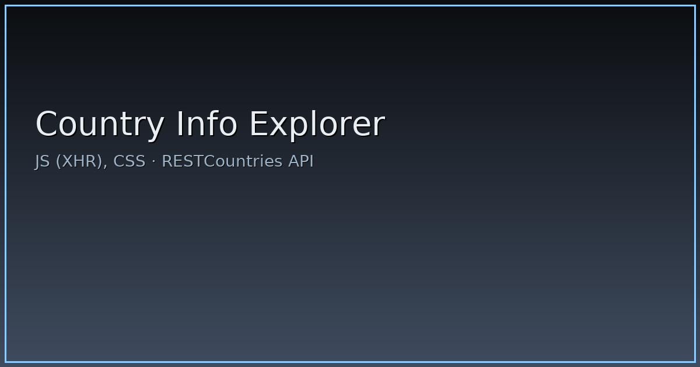

# Country Info Explorer

SPA для получения и отображения информации о странах через RESTCountries API.

## Live Demo
(вставьте ссылку)

## Стек
JavaScript, DOM API, Custom XHR (без fetch/async), CSS

## Возможности
- Поиск страны по названию
- Данные: флаг, столица, регион, население и др.
- Загрузка соседних стран отдельным запросом
- Лоадер и обработка ошибок

## Скриншоты
_(добавьте 1–3 изображения в папку `assets/` и вставьте ссылки)_

## Быстрый старт
Откройте `index.html` локально или через статический хостинг.

## Лицензия
MIT

## Превью

