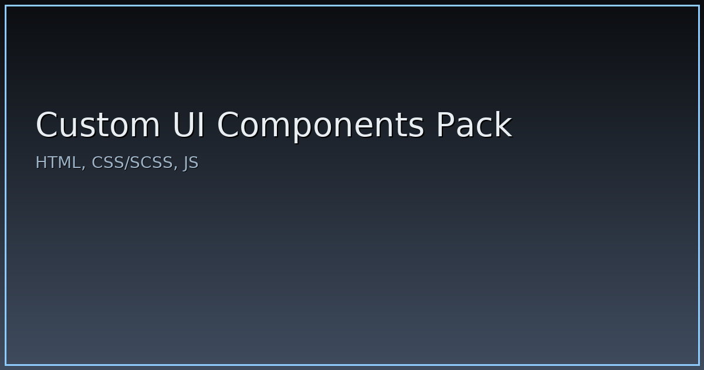

# Custom UI Components Pack

Набор часто используемых UI-компонентов для фронтенд-проектов.

## Компоненты
- Кастомный `alert`/`confirm`
- CSS-прелоадер (в т.ч. по Luke Haas)
- Tooltip
- Toast-уведомления

## Установка
Скопируйте файлы из `dist/` в свой проект и подключите CSS/JS.

## Использование
Смотрите примеры в `examples/`.

## Лицензия
MIT

## Превью

