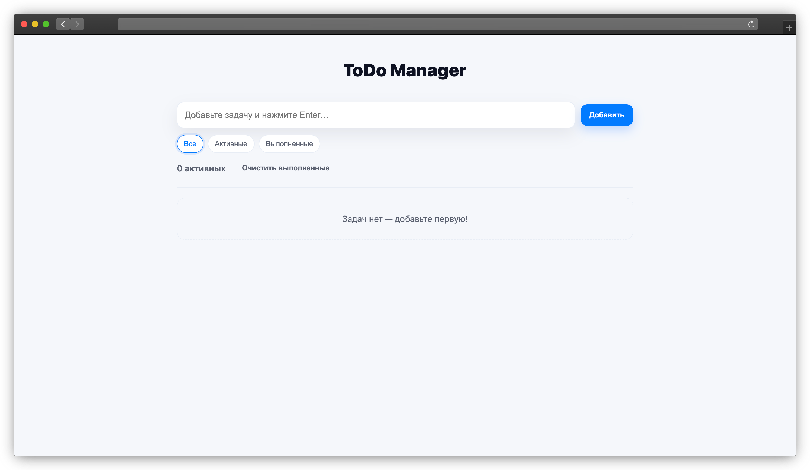

# ✅ ToDo Manager

Task management application for creating, managing, and organizing daily tasks.  
The app allows users to add, delete, and filter tasks with data persistence via localStorage.

---

## 🚀 Live Demo
https://myasoutovd-cloud.github.io/my-portfolio/projects/todo-manager/

---

## 🛠️ Tech Stack
- JavaScript (Vanilla JS)
- HTML5
- CSS3
- localStorage

---

## ✨ Features
- Add new tasks
- Delete tasks
- Mark tasks as completed
- Filter tasks (all / completed / active)
- Save tasks in localStorage
- Clean and simple user interface

---

## 📂 Project Structure
```
projects/todo-manager/
├─ index.html
├─ styles.css
├─ script.js
├─ assets/
│  └─ todo-preview.png
└─ README.md
```
---

## 🧠 What I practiced
- Working with the DOM
- Handling user events
- Using localStorage for data persistence
- Organizing JavaScript logic
- Writing clean and readable code

---

## 📸 Preview


---

## 📌 Notes
This project was built as a practice application to strengthen core JavaScript skills and understanding of frontend fundamentals.