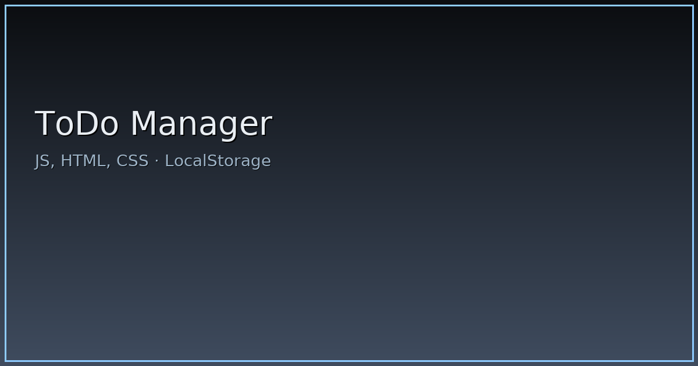

# ToDo Manager

Менеджер задач с фильтрацией и сохранением данных.

## Live Demo
(вставьте ссылку)

## Стек
JavaScript (ES6), HTML, CSS (Grid/Flex), LocalStorage

## Возможности
- CRUD задач
- Фильтры/поиск
- Кастомные модалки и уведомления
- Адаптивная верстка

## Скриншоты
_(добавьте 1–3 изображения в папку `assets/` и вставьте ссылки)_

## Быстрый старт
Откройте `index.html` локально или через статический хостинг.

## Структура
- `index.html`
- `styles/`
- `js/`

## Лицензия
MIT

## Превью

